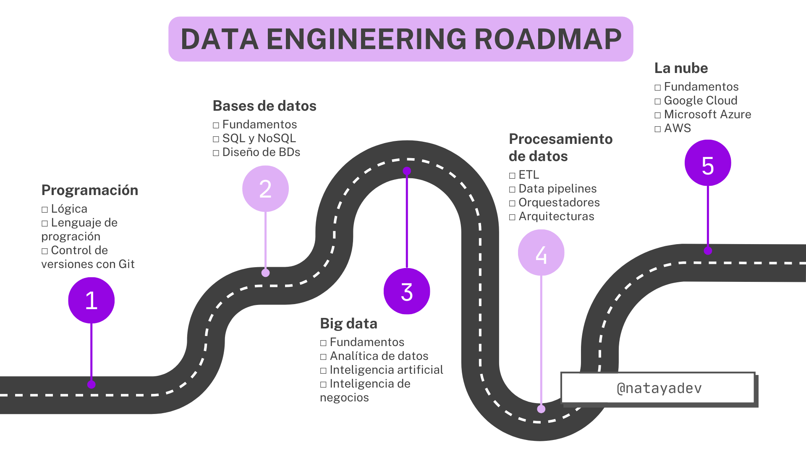

<h1 align="center"> Roadmap 2024 - Data engineering en español</h1>

 Un repositorio más con conceptos básicos, desafíos técnicos y recursos sobre ingeniería de datos en español 🧙✨

 ¿Te gustaría aportar al repositorio? Visitá la <a href="CONTRIBUTING.md">guía de contribución</a> 

*Nota: la siguiente ruta de aprendizaje está diseñada a **criterio personal** con la idea de facilitar el estudio de aquellos interesados en la ingeniería de datos con material libre, gratuito y en español que encontré en internet. **No es** una guía definitiva ni un curso, **es** una lista de recursos que puede ser mejorada con el tiempo con contribuciones de la comunidad.*

[📚 Libros de ingeniería de datos en inglés](books)

## Programación
### 🚀 Fundamentos

Comenzamos con la comprensión de los conceptos fundamentales de programación y lógica. Esta sección puede ser desarrollada simultáneamente con el aprendizaje del lenguaje de programación que elijan.

- [Curso: Programación Básica de Platzi](https://platzi.com/cursos/programacion-basica/)
- [Videos: Introducción a los Algoritmos y la Programación de TodoCode](https://www.youtube.com/playlist?list=PLQxX2eiEaqbzRVxjkstjLmmn9enb0x3zi)
- [Videos: Ejercicios de Pseudocódigo de TodoCode](https://www.youtube.com/playlist?list=PLQxX2eiEaqbwHMRObsvtRSb6sA43msUJt)
- [Videos: Linea de Comandos de Datademia](https://www.youtube.com/playlist?list=PLlhVpWerA0KzfxmP5CRFvmnEkRFldCUqI)
- [Videos: Bash scripting de Fazt](https://www.youtube.com/playlist?list=PLL0TiOXBeDai--LxFT1tro1qzO4Ayg5p_)
- [Lectura: Introducción a la línea de comandos de Linux y el shell de Microsoft Learn](https://learn.microsoft.com/es-es/training/paths/shell/)

### 🐍 Lenguaje de programación

Recomiendo iniciar con Python debido a su curva de aprendizaje amigable y su prevalencia en la industria actual. No obstante, es importante destacar que el procesamiento de datos también puede realizarse con R, Java, Scala, Julia, entre otros.

- [Videos: Python desde 0 de PildorasInformáticas](https://www.youtube.com/playlist?list=PLU8oAlHdN5BlvPxziopYZRd55pdqFwkeS)
- [Curso: Computación científica con Python de FreeCodeCamp](https://www.freecodecamp.org/learn/scientific-computing-with-python/)
- [Curso: Álgebra universitaria con Python de FreeCodeCamp](https://www.freecodecamp.org/learn/college-algebra-with-python/)
- [Curso: Harvard CS50’s Introducción a la programación con Python subtítulado de FreeCodeCamp](https://www.youtube.com/watch?v=nLRL_NcnK-4&ab_channel=freeCodeCamp.org)
- [Curso: Python intermedio subtitulado de FreeCodeCamp](https://www.youtube.com/watch?v=HGOBQPFzWKo&ab_channel=freeCodeCamp.org)
- [Curso: Pandas de Kaggle](https://www.kaggle.com/learn/pandas)
- [Videos: Expresiones Regulares de Ada Lovecode](https://www.youtube.com/playlist?list=PLI7nHlOIIPOJNEgw0BHE415nQST8Ve3JN)
- [Video: Principios de la Programación Orientada a Objetos de BettaTech](https://www.youtube.com/watch?v=tTPeP5dVuA4&ab_channel=BettaTech)
- [Videos: Programación Orientada a Objetos explicada con Minecraft de Absolute](https://www.youtube.com/playlist?list=PL-9YbO84eUcfKPIbzI6-ledKGY_6_Fvcj)
- [Curso: Julia para gente con prisa de Miguel Raz](https://github.com/miguelraz/JuliaParaGenteConPrisa)

### 🔄 Control de versiones con Git

El aprendizaje sobre el control de versiones no solo es valioso al trabajar en equipos, sino que también nos proporciona la capacidad de rastrear, comprender y gestionar los cambios realizados en nuestro proyecto y así mantener un desarrollo eficiente y colaborativo.

- [Video: ¿Qué es el control de versiones y porque es tan importante para programar? de Datademia](https://www.youtube.com/watch?v=8HSjmgeJxqg&ab_channel=Datademia)
- [Curso: Git y Github de MoureDev](https://www.youtube.com/watch?v=3GymExBkKjE&ab_channel=MoureDevbyBraisMoure)
- [Videos: Git y Github de TodoCode](https://www.youtube.com/playlist?list=PLQxX2eiEaqby-qh4raiKfYyb4T7WyHsfW)
- [Lectura: Usa Git correctamente de Attlasian](https://www.atlassian.com/es/git)
- [Juego: Learn Git Branching](https://learngitbranching.js.org/?locale=es_AR)

### 🛠️ Más herramientas

- Notebooks: [Google Collab](https://colab.google/), [Jupyter](https://jupyter.org/) o [Deepnote](https://deepnote.com/)
- IDE: [VSCode](https://code.visualstudio.com/) o [Spyder](https://www.spyder-ide.org/)

## Bases de datos
### 🚀 Fundamentos
En esta instancia toca aprender sobre las bases de datos. La elección del gestor de bases de datos a utilizar queda a tu criterio, aunque personalmente recomiendo [PostgreSQL](https://www.postgresql.org/) para datos estructurados y [MongoDB](https://www.mongodb.com/es) para datos no estructurados. Sin embargo, existen muchas otras opciones: MySQL, SQLite y demás.

- [Videos: Introducción a las bases de datos de TodoCode](https://www.youtube.com/playlist?list=PLQxX2eiEaqbwcW3dkmUqJq7B-SXHyCglf)
- [Lectura: Diferencias entre DDL, DML y DCL de TodoPostgreSQL](https://www.todopostgresql.com/diferencias-entre-ddl-dml-y-dcl/)
- [Video: Procedimientos almacenados #1 de Héctor de León](https://youtu.be/NCcc2aISGtE?si=SZpgTmkSRmYzzmRd)
- [Video: Procedimientos almacenados #2 de Héctor de León](https://youtu.be/B9yw925kdiw?si=WwndA4YEmzKS3MsN)
- [Video: MongoDB de Fazt](https://www.youtube.com/watch?v=lWMemPN9t6Q&ab_channel=Fazt)
- [Videos: MongoDB de MitoCode](https://www.youtube.com/playlist?list=PLvimn1Ins-43y_9RNEo4JIFdpA5SJCYey)
    
### 📊 SQL
También aprenderás SQL, un lenguaje de consulta para gestionar y manipular las bases de datos relacionales.
- [Videos: SQL de Data Engineering LATAM](https://www.youtube.com/playlist?list=PLdxuOh58KNA6ybDbpk4pmk5BCxluqz5cS)
- [Intro to SQL de Kaggle](https://www.kaggle.com/learn/intro-to-sql)
- [Advanced SQL de Kaggle](https://www.kaggle.com/learn/advanced-sql)

### 📐 Diseño
Ahora seguimos con conceptos más avanzados que nos servirán para diseñar bases de datos, datalake, datawarehouses, esquemas, etcétera.
- [Video: ¿Cuándo utilizar SQL y cuando NoSQL? de Héctor de León](https://www.youtube.com/watch?v=EwJlyyq2urE&list=PLWYKfSbdsjJi6lb_dZ-UrGwRCJxmjhapl&index=9&ab_channel=hdeleon.net)
- [Video: ¿Cómo se modelan las bases de datos NoSQL? de HolaMundo](https://youtu.be/Zdlude8l8w4?si=gfIqq3gknpT4nDT4)
- [Lectura: Bases de datos orientadas a grafos de Oracle](https://www.oracle.com/ar/autonomous-database/what-is-graph-database/)
- [Video: Bases de Datos de Grafos, Fundamentos y Práctica de Datahack](https://www.youtube.com/watch?v=gDiZQ60LkpE&ab_channel=Datahack)
  
## Big Data
Lo siguiente es entender algunos conceptos de Big Data. Además, resulta interesante adquirir conocimientos básicos sobre inteligencia artificial, inteligencia de negocios y análisis de datos sin la necesidad de profundizar demasiado.
### 🚀 Fundamentos
- [Video: Big Data para dummies de Datahack](https://www.youtube.com/watch?v=DabkDUsNfIg&ab_channel=Datahack)
- [Lectura: Big Data: ¿Qué es y cómo ayuda a mi negocio? de Salesforce](https://www.salesforce.com/mx/blog/big-data/)
- [Certificación: Diseña y programa soluciones IoT con el uso de Big Data de Universidad del Rosario](https://www.edx.org/es/certificates/professional-certificate/urosariox-internet-de-las-cosas-iot-big-data-y-sus-aplicaciones?index=spanish_product&queryID=b0edf1baa13ad200be83166c876cea13&position=1&results_level=second-level-results&term=big+data&objectID=program-04e59d90-d7a3-48bb-a1f6-603982989153&campaign=Internet+de+las+cosas+%28IoT%29%2C+Big+Data+y+sus+aplicaciones&source=edX&product_category=professional-certificate&placement_url=https%3A%2F%2Fwww.edx.org%2Fes%2Fsearch)
- [Certificación: Big Data de University of California San Diego](https://www.coursera.org/specializations/big-data)
- [Video: Big data y privacidad de Databits](https://www.youtube.com/watch?v=-5kmGbc0RFM&list=PLkNVRh-NXvLaEbeScgn1raK48gxiEj_1q&index=18&ab_channel=Databits)
### 📊 Analítica (opcional)
- [Certificación: Fundamentos profesionales del análisis de datos, de Microsoft y LinkedIn](https://www.linkedin.com/learning/paths/fundamentos-profesionales-del-analisis-de-datos-por-microsoft-y-linkedin?src=direct%2Fnone&veh=direct%2Fnone)
- [Certificación: Certificado profesional de Google Data Analytics](https://www.coursera.org/professional-certificates/google-data-analytics#courses)
- [Certificación: Certificado profesional de Analista de datos de IBM](https://www.coursera.org/professional-certificates/ibm-data-analyst)
- [Curso: Análisis de datos con Python de FreeCodeCamp](https://www.freecodecamp.org/learn/data-analysis-with-python/)
- [Video: Storytelling: ¿Cómo convertir tu contenido en una historia? de Coderhouse](https://www.youtube.com/watch?v=pPHRb1dVRDE&ab_channel=Coderhouse)
### 🤖 Inteligencia artificial (opcional)
- [Curso: Machine Learning con Python de FreeCodeCamp](https://www.freecodecamp.org/learn/machine-learning-with-python/)
- [Canal: AprendeIA con Ligdi Gonzalez](https://www.youtube.com/@aprendeIA/playlists)
- [Videos: Aprende Inteligencia Artificial de Dot CSV](https://www.youtube.com/playlist?list=PL-Ogd76BhmcC_E2RjgIIJZd1DQdYHcVf0)
- [Video: Cómo usar ChatGPT en ingeniería de datos de Datalytics](https://www.youtube.com/watch?v=cg9VGCqLe9U&ab_channel=Datalytics)
- [Curso: Inteligencia Artificial subtitulado de Universidad de Columbia](https://www.edx.org/es/learn/artificial-intelligence/columbia-university-artificial-intelligence-ai)
### 📈 Inteligencia de negocios (opcional)
- [Videos: Google Business Intelligence Certificate subtitulado de Google Career](https://www.youtube.com/playlist?list=PLTZYG7bZ1u6r3YwRBuSE7xIMYAiN2Bl85)
- [Videos: ¡Business Intelligence para Todos! de PEALCALA](https://www.youtube.com/playlist?list=PLCpKRQB2yv13cmUkcVlxVWA3md3uE9u3N)

## Procesamiento de Datos
En esta sección está el corazón de la ingeniería de datos, veremos que son los data pipelines, qué es un ETL, orquestadores, y más.
- [Canal: CodinEric](https://www.youtube.com/@CodinEric)
- [Canal: Data Engineering LATAM](https://www.youtube.com/@DataEngineeringLatam)
- [Canal: Datademia](https://www.youtube.com/@datademia)
- [Canal: Datalytics](https://www.youtube.com/@datalytics.mejorcondatos)

### 🔍 ETL y Data Pipelines

- [Video: Ingeniería de datos: viaje al corazón de los proyectos de datos de RockingData](https://www.youtube.com/watch?v=UPPOEFUrvFU&list=PLwKA-LJRe79hxt69x6GVqTofHUetiB9vQ&index=8&ab_channel=RockingData)
- [Video: ¿Cómo convertirte en un verdadero Ingeniero de Datos? de Databits](https://www.youtube.com/watch?v=OiWR3pRyvgE&list=PLkNVRh-NXvLaEbeScgn1raK48gxiEj_1q&index=4&ab_channel=Databits)
- [Videos: Preprocesamiento de Datos en Python de Rocio Chavez](https://www.youtube.com/playlist?list=PLUofJx5RUeFqAIVdzfnJayenwZFEGtCmg)
- [Videos: Preprocesamiento de Datos en R de Rocio Chavez](https://www.youtube.com/playlist?list=PLUofJx5RUeFqGJJxKflkhDRTot29M7CYj)

### 🎭 Orquestadores

- [Videos: Airflow de Data Engineering LATAM](https://www.youtube.com/playlist?list=PLdxuOh58KNA6tjwp2xMiucO53XsvaG48L)
- [Videos: Luigi subtitulado de Seattle Data Guy](https://www.youtube.com/playlist?list=PLXRKPZRrlvE4c5fkoYYC34MLTwZ7ZQoje)
- [Lectura: Azure Data Factory de Microsoft](https://learn.microsoft.com/es-es/azure/data-factory/introduction)

### 🏰 Arquitecturas

- [Lectura: Diferencias clave entre el OLAP y el OLTP de AWS](https://aws.amazon.com/es/compare/the-difference-between-olap-and-oltp/)
- [Video: Construye ETL en batch y streaming con Spark de Databits](https://www.youtube.com/watch?v=hvwuMCPSB3M&list=PLkNVRh-NXvLaEbeScgn1raK48gxiEj_1q&index=13&ab_channel=Databits)
- [Lectura: Comparación de contenedores y máquinas virtuales de Atlassian](https://www.atlassian.com/es/microservices/cloud-computing/containers-vs-vms)
- [Videos: Docker de Pelado Nerd](https://www.youtube.com/playlist?list=PLqRCtm0kbeHAep1hc7yW-EZQoAJqSTgD-)
- [Videos: Kubernetes de Pelado Nerd](https://www.youtube.com/playlist?list=PLqRCtm0kbeHA5M_E_Anwu-vh4NWlgrOY_)
- [Lectura: ¿Qué es un sistema distribuido? de Atlassian](https://www.atlassian.com/es/microservices/microservices-architecture/distributed-architecture)
- [Videos: Spark de Data Engineering LATAM](https://www.youtube.com/playlist?list=PLdxuOh58KNA6CH3sQS6zhuIVKoPllmXiB)
- [Video: Infraestructura como código para ingeniería de datos de Spark México](https://www.youtube.com/watch?v=FjB3-RS_s38&ab_channel=SparkMexico)
- [Videos: Apache Spark de NullSafe Architect](https://www.youtube.com/playlist?list=PLwH0tlWs8nkQ-56HPCFeKsCJIStOOn_3j)
- [Videos: Apache Kafka de NullSafe Architect](https://www.youtube.com/playlist?list=PLwH0tlWs8nkSQRxizVF5Uuu-sLVYqdjaW)

## Cloud

Es útil tener conocimientos de cloud computing. Llegado a este punto, te recomendaría considerar la preparación de certificaciones oficiales. Aunque estos exámenes suelen tener un costo, puedes encontrar recursos de preparación gratuitos y oficiales de los proveedores más conocidos en la industria.

### ☁️ Fundamentos de la nube

- [Video: Fundamentos de Cloud Computing de Datahack](https://www.youtube.com/watch?v=ck9qignm_uY&ab_channel=Datahack)
- [Lectura: Descubre las ventajas y desventajas de la nube de Platzi](https://platzi.com/blog/ventajas-y-desventajas-de-la-nube-guia-completa/)
- [Lectura: Arquitectura para Big Data en Cloud de Platzi](https://platzi.com/blog/arquitectura-para-big-data-cloud/)

### 📜 Certificaciones oficiales

- [Ingeniería de datos de Google Cloud](https://www.cloudskillsboost.google/paths/16?hl=es-419)
    - [Videos: Google Cloud (GCP) de Aprender Big Data](https://www.youtube.com/playlist?list=PLGnDOd349NCNtUCRdRbtMRKl0V2gPPr5G)
- [Ingeniería de datos de Microsoft Azure](https://learn.microsoft.com/es-es/credentials/certifications/exams/dp-203/)
    - [Videos: Azure de Data Engineering LATAM](https://www.youtube.com/playlist?list=PLdxuOh58KNA5KdJXw7Z3TZMgKD90guixl)
    - [Videos: Certificaciones de Azure de Aprender Big Data](https://www.youtube.com/playlist?list=PLGnDOd349NCNxtsQpeWtIyD7lY1IrYw-n)
- Ingeniería de datos de AWS (pronto)
    - [Videos: AWS de Data Engineering LATAM](https://www.youtube.com/playlist?list=PLdxuOh58KNA5wi_1xtajCa9WjpobZUZl-)

## Búsqueda Laboral
Finalmente te dejo algunas lecturas y videos que ofrecen consejos y experiencias relacionadas con la búsqueda laboral en el ámbito de sistemas. Más adelante, se agregarán desafíos técnicos y otros recursos vinculados al tema.
### 🔍 Consejos
- [Video: ¿Cómo obtener tu primer empleo en ingeniería de datos? de Spark México](https://www.youtube.com/watch?v=E3AviR1_Y_c&ab_channel=SparkMexico)
- [Videos: Consejos Laborales para el mundo IT de TodoCode](https://www.youtube.com/playlist?list=PLQxX2eiEaqbwcH3zocNIeDNL6ExUorxa9)
- [Videos: Esenciales para comenzar en el mundo de los sistemas de Maxi Programa](https://www.youtube.com/playlist?list=PLQRFzsIQFmxq6DUftRLXkOE5hiEej2EoJ)
- [Hilo: Consejos para completar el perfil de LinkedIn de @natayadev](https://twitter.com/natayadev/status/1667477410172882944)
- [Hilo: Consejos para conseguir un trabajo remoto en IT de @natayadev](https://twitter.com/natayadev/status/1714336919876747318)
- [Hilo: Cómo crear un CV ordenado y legible de @iamdoomling](https://twitter.com/iamdoomling/status/1410207350418509825)
- [Hilo: Te dejo estos tips para sobrevivir entrevistas con recursos humanos de @iamdoomling](https://twitter.com/iamdoomling/status/1468294464636653569)
- [Video: Programar en empresas, startups o freelance ¿Qué es mejor? de @iamdoomling](https://www.youtube.com/watch?v=JyTOzSuh4Ho&ab_channel=ProgramandoconBel)
- [Video: Terminé el bootcamp de programación ¿Y ahora qué? de @iamdoomling](https://www.youtube.com/watch?v=XDrgvD5Vp9Q&ab_channel=ProgramandoconBel)
- [Video: Trabajar como contractor desde Argentina de @iamdoomling](https://www.youtube.com/watch?v=2rLfcDI9Oh0&ab_channel=ProgramandoconBel)
- [Podcast: DevRock de Jonatan Ariste](https://open.spotify.com/show/5uRPZ5r7bRkW29c5AkppXq)

### 🛠️ Desafíos técnicos
- [Repositorio: Desafíos de código de la comunidad de MoureDev](https://github.com/mouredev/Code-Challenges)
  
En proceso 😊

---
**Si te resultó útil este repositorio, regalame una estrella ⭐**

 
